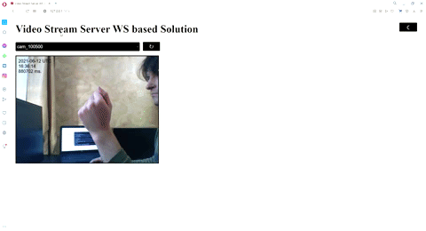
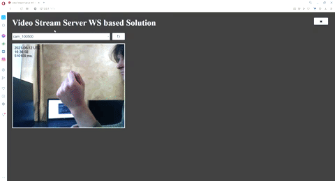

# stream_video_server

The project demonstrates some ways how to create video streaming servers with the help of Aiohttp and OpenCV.

Ways are listed from the simplest implementations to more robust solutions.
 
If you would like to have more production ready solution with appropriate error handling, docker containers,
docker-compose etc - take a look at the third implementation and skip the first two. If you would like to start from 
more tutorial-like code, start from the 1st and the 2nd implementations.

### **The idea of Application (The 3rd implementation):**

**The Aim:** to create http server which can stream video to web browser data from several remote cameras

The application is composed of two services: 1. http server 2. video processing process 3. Optionally Nginx

### **First One: The Easiest Video Server Implementation:**

_How to run The Easiest Video Server Implementation:_

1. create venv

2. install all requirement from `requirement.txt`

3. `python -m aiohttp.web -H 0.0.0.0 -P 7474 easy_http_server:create_app` // `python3` in Linux

_PROs:_

1. Easy to implement
2. All in one Process

_CONs:_

1. The more users watch video, the more static video looks like. Note that video is a sequence of images, and in this
implementation images are yielded from generator function, so part of images goes to one user, part of images goes
to another user.

### **Second One: Easy Websocket Video Server Implementation:**

_How to run Easy Websocket Video Server Implementation:_

1. create venv

2. install all requirement from `requirement.txt`

3. `python -m aiohttp.web -H 0.0.0.0 -P 7474 easy_ws_http_server:create_app` // `python3` in Linux

_PROs:_

1. easy to implement
2. Use websockets which are modern solution for bidirectional communications with browser

_CONs:_

1. Though websockets are faster, still the more users watch video, the more static video looks like.
Note that video is a sequence of images, and in this implementation images are yielded from generator function,
so part of images goes to one user, part of images goes to another user.

### **Third One: Websocket Video Server Implementation:**

_1. How to run Websocket Video Server Implementation:_

1. create venv

2. install all requirement from `requirement.txt`

3. `python -m aiohttp.web -H 0.0.0.0 -P 7474 ws_http_server:create_app` // `python3` in Linux

_2. How to run Video Processing Process_

1. create venv

2. install all requirement from `requirement.txt`

3. `python video_source_process/vid_s_pr.py` // `python3` in Linux
 
_PROs:_

1. Can handle multiple clients (browsers) and provide all frames to all clients with small delay
2. Can handle slow clients with nearly no negative effect on other clients
3. Use websockets which are modern solution for bidirectional communications with browser
4. Video Processing is done in another process = less CPU bound ops in http server,
can be distributed between several nodes

_Cons:_

1. Do not scale well, only one http process can work simultaneously. 

##### **_How to deploy application with Docker or/and Docker-Compose:_**

**_Note:_** you still have to run `python video_source_process/vid_s_pr.py` (Video Processing App) without Docker, though it is possible
to run OpenCV app in docker, you need to to use `--device=` docker flag to use default camera by index.

1. Create Images and run with the help of Docker-Compose:

1.1 `docker build -t video_ng . // run command in nginx folder`

1.2 `docker build -t video_server . // run command in ws_http_server folder`

1.3 `docker-compose up -d // run command in stream_video_server folder`

2. Create Images and run with the help of Docker only:

2.1 `docker build -t video_ng . // run command in nginx folder`

2.2 `docker build -t video_server . // run command in ws_http_server folder`

2.3 `docker network create video_server_net`

2.4 `docker run --name video_server --network aio_net -d video_server`

2.5 `docker run --name video_ng --network aio_net -p 7474:7474 -d video_ng`

